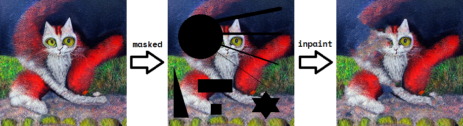

# Content Aware Fill for Linux's Python



A simple baseline for image inpainting (not learning-based method, implemented in pure C/C++).

The program will automatically fill in masked region via Content Aware Fill algorithm. An online interactive demo can be found [here](https://61315.github.io/resynthesizer/painter.html).

I borrowed from other's [repo](https://github.com/61315/resynthesizer), and I made it usable for Linux's Python.

## Build from Source

You can build it from source by (assume pybind11 is installed by python):
```bash
git clone git@github.com:Karbo123/content-aware-fill.git --depth=1
cd content-aware-fill
# build & install
make install-content-aware-fill
# just build, don't install
# make content-aware-fill
```

## Usage

You can use it as follows:
```bash
cd python && ipython

# inside python, run:
import libcontent_aware_fill as cwf, cv2
img = cv2.imread("../assets/cat.png")
mask = cv2.imread("../assets/mask.png", 0)
img_masked = img * (~mask[..., None]).astype(bool)
out = cwf.content_aware_fill(img_masked, mask)
cv2.imwrite("../assets/cat_img_masked.png", img_masked)
cv2.imwrite("../assets/cat_mask.png", mask)
cv2.imwrite("../assets/cat_out.png", out)
# result images have been written to:
#   ../assets/cat_img_masked.png  (input)
#   ../assets/cat_mask.png        (input)
#   ../assets/cat_out.png         (output)

```

## API

The full API usage can be printed out:
```python

cd python && ipython

# inside python, run:
import libcontent_aware_fill as cwf
cwf.content_aware_fill?
# Perform Content Aware Fill Algorithm for `image` given the inpainting mask `mask`
# Params:
#  - image (numpy.ndarray): shape=(H, W, C), uint8, row-major, contiguous, C=1(Gray)/2(GrayA)/3(RGB)/4(RGBA)
#  - mask (numpy.ndarray): shape=(H, W), uint8, row-major, contiguous, 255 for regions to be filled
# Return:
#  - image_out (numpy.ndarray): shape=(H, W, C), uint8, C=1(Gray)/2(GrayA)/3(RGB)/4(RGBA)
# Full API:
#     Array content_aware_fill(
#         Array image, Array mask,
#         bool isMakeSeamlesslyTileableHorizontally=false,
#         bool isMakeSeamlesslyTileableVertically=false,
#         int matchContextType=1,
#         float mapWeight=0.5f,
#         float sensitivityToOutliers=0.117f,
#         int patchSize=30,
#         int maxProbeCount=200
#     )
```

For `matchContextType` (i.e. type of fitting method), its meaning is as follows:

| Context | Method      | Shape      | Direction |
|---------|-------------|------------|-----------|
| 0       | Patching    | -          | -         |
| 1       | Shuffle     | Random     | Random    |
| 2       | Brushfire   | Concentric | Inward    |
| 3       | Directional | Horizontal | Inward    |
| 4       | Directional | Vertical   | Inward    |
| 5       | Brushfire   | Concentric | Outward   |
| 6       | Directional | Horizontal | Outward   |
| 7       | Directional | Vertical   | Outward   |
| 8       | Squeeze     | Concentric | Both      |

